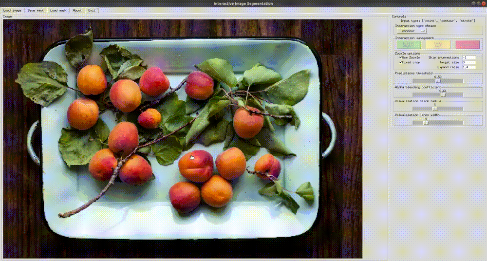
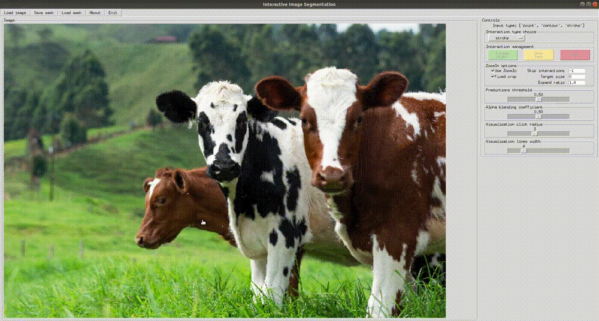
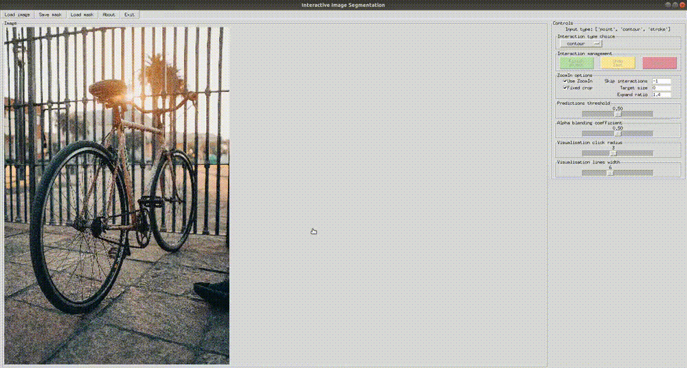

# SAIC-IS: A Benchmark for High Resolution Interactive Image Segmentation
This repository provides the official PyTorch implementation for training and testing of interactive segmentation models presented the following paper:
> SAIC-IS: A Benchmark for High Resolution Interactive Image Segmentation
> 
> Samsung AI Center Moscow

## Setting up an environment
This framework is built using Python 3.8 and relies on the PyTorch 1.11.0+.
The following command installs all necessary packages:

```.bash
pip3 install -r requirements.txt
```

You can also use our [Dockerfile](./Dockerfile) to build a container with configured environment. 

If you want to run training or testing, you must rename [config.yml.default](./config.yml.default) to `config.yml` and configure paths in [config.yml](./config.yml).

## Datasets
We train all our models on combination of [COCO](http://cocodataset.org) and [LVIS](https://www.lvisdataset.org) datasets.

All our models are evaluated on the following datasets:

| **Dataset**    | **\# Images** | **\# Instances** | **Median res. in MP** |
|----------------|--------------:|-----------------:|----------------------:|
| GrabCut        |            50 |               50 |                  0.25 |
| Berkeley       |            96 |              100 |                  0.15 |
| SBD            |          2857 |             6671 |                   0.2 |
| PASCAL VOC     |          1449 |             3417 |                   0.2 |
| DAVIS          |           345 |              345 |                   0.4 |
| SAIC_IS (ours) |          1000 |             1553 |                    17 |

Don't forget to change paths to the datasets in [config.yml](./config.yml) after downloading and unpacking.

## Interactive Segmentation Demo
The GUI is based on TkInter library and it's Python bindings.







You can try the interactive demo with any of the provided models (see section below).
Our scripts automatically detect the architecture of the loaded model, just specify the path to the corresponding checkpoint.

To run demo GUI, run the following:
```
python3 demo.py --checkpoint=exp.pth --cpu --fixed-h 448 --fixed-w 448
```

### Controls
* press left and right mouse buttons for positive and negative interactions, respectively
* press space to finish annotation of an area 

### Interactive segmentation options
* Interaction type choice
    * choose any input type at the top of the right menu
    * change it later when required (progress of the previous interactions will be saved)
* ZoomIn (can be turned on/off using the checkbox)
    * Skip interactions -- number of interactions to skip before using ZoomIn
    * Target size -- ZoomIn crop is resized so its longer side matches this value (increase for large objects)
    * Expand ratio - object bbox is rescaled with this ratio before crop
* Visualisation parameters
    * Prediction threshold slider adjusts the threshold for binarization of probability map for the current object
    * Alpha blending coefficient slider adjusts the intensity of all predicted masks
    * Visualisation click radius slider adjusts the size of red and green dots depicting clicks
    * Visualisation lines width slider adjusts the width of red and green lines depicting contours and strokes

## Testing

### Pretrained models
We provide pretrained multi-input models with Segformer and HRNet18 backbones for interactive segmentation.

You can find model weights and evaluation results on the SAIC-IS dataset in the tables below:

|      **Backbone**      |    **IoU**     |    **bIoU**    |
|------------------------|---------------:|---------------:|
| [HRNet18][hrnet18]     | 84.99 $\pm$ 2.20 | 51.95 $\pm$ 1.92 |
| [Segformer][segformer] | 89.86 $\pm$ 0.87 | 57.26 $\pm$ 1.54 |

[hrnet18]: https://github.com/SamsungLabs/saic-is/releases/download/v1.0/hrnet18_multi.pth
[segformer]: https://github.com/SamsungLabs/saic-is/releases/download/v1.0/segformer_multi.pth

To run the provided models, download and save them to the directory specified in the `EXPS_PATH` config field.

### Evaluation
We provide a script to test all the presented models the SAIC-IS dataset.
GrabCut, Berkeley, DAVIS, SBD, and PASCAL VOC are also available for evaluation.
To test any of our models, just specify a path to the corresponding experiment relative to the `EXPS_PATH` config field.
Our scripts automatically detect the architecture of the loaded model.

To compute IoU metrics for a model, run the following:
```.bash
python3.8 scripts/evaluate_model.py NoBRS --gpus=0 --exp-path=segformer_multi.pth --datasets=SAIC_IS --fixed-h=448 --fixed-w=448 --max-size=1000
```

To compute BoundaryIoU metrics for a model, run the following:
```.bash
python3.8 scripts/evaluate_model.py NoBRS --gpus=0 --exp-path=segformer_multi.pth --datasets=SAIC_IS --fixed-h=448 --fixed-w=448 --max-size=1000 --boundary-iou
```

To compute Number of Interactions @85, 90, 95 instead of [B]IoU averages, run the following:
```.bash
python3.8 scripts/evaluate_model.py NoBRS --gpus=0 --exp-path=segformer_multi.pth --datasets=GrabCut,Berkeley,DAVIS,SBD,PascalVOC,SAIC_IS --fixed-h=448 --fixed-w=448 --max-size=1000 [--boundary-iou] --noi
```

## Training

For each experiment, a separate folder is created in the `./experiments` with Tensorboard logs, text logs, visualization and model's checkpoints.
You can specify another path in the [config.yml](./config.yml) (see `EXPS_PATH` variable).

To train a Segformer-based multi-input model, run the following:
```.bash
python3.8 train.py models/segformer/segformer_cocolvis_itermask_multi_input.py --gpus=0,1,2,3 --workers=8 --exp-name=exp 
```

To train an HRNet-based multi-input model, run the following:
```.bash
python3.8 train.py models/hrnet/hrnet18_cocolvis_itermask_multi_input.py --gpus=0,1 --workers=8 --exp-name=exp 
```

We used pre-trained HRNetV2 models from the [HRNet official repository](https://github.com/HRNet/HRNet-Image-Classification)
and Segformer models from the [Segformer official repository](https://github.com/NVlabs/SegFormer).
To train our models, download backbone weights and specify corresponding paths in [config.yml](./config.yml) (see `IMAGENET_PRETRAINED_MODELS` variable).

## Configuration file
The configuration file [config.yml](./config.yml) is used for training and testing.
We provide descriptions for its fields further.

* `INTERACTIVE_MODELS_PATH`: path to a directory with model weights used in [demo.py](./demo.py)
* `EXPS_PATH`: path to a directory where training and evaluation results are saved
* `Evaluation datasets`, `Train datasets`: paths to the datasets
* `IMAGENET_PRETRAINED_MODELS`: paths to checkpoints of the pre-trained HRNet and Segformer models
* `MODEL`:
  * `WITH_FORCE_POINTS_LOSS`: if additional BCE loss should be added during training, this loss is calculated at positions corresponding to interactions' locations
  * `OPTIMIZER_TYPE`: optimizer type for training, available options: "sgd", "adam", "adamw"
  * `BATCH_SIZE`: training batch size
  * `TRAIN_SIZE`: crop size of an image used during training
  * `INPUT_TYPE`: specification of an input type for a single-input model training, available options: "point", "contour", "stroke"
  * `ACCUMULATE_MULTI_INPUT`: if a unified multi-input model should be trained and tested with the previous interactions of all types accumulated on the corresponding maps.
    If False, only the last interaction's type is provided at each interactive step
  * `PRETRAINED_PATH`: use pre-trained weights for training
  * `CONTOUR_FILLED`: if contour should be encoded as a binary mask of a contour's line or a contour's filled mask
* `SEGFORMER`:
  * `WITH_AUX_HEAD`: if Segformer should be trained with BCE loss on an intermediate auxiliary output 
  * `LR_TYPE`: learning rate schedule type for Segformer training, available options: "linear", "cosine", "step"

## License
The code is released under the MIT License.
It is a short, permissive software license.
Basically, you can do whatever you want as long as you include the original copyright and license notice in any copy of the software/source.

## Citation
If you find this work is useful for your research, please cite our paper:
